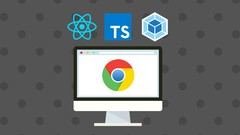

# React & TypeScript Chrome Extension Development [2022]
[**Udemy React & TypeScript Chrome Extension Development [2022]**](https://www.udemy.com/course/chrome-extension/)

---

セクション1: Course Orientation

セクション2: Chrome Extension Basics

セクション3: Beginner Project: Study Timer Extension

セクション4: Data Fetching and More Chrome APIs

セクション5: TypeScript, React and Webpack Build System

セクション6: Advanced Project: Weather Extension

セクション7: Final Project: AdBlock Extension

セクション8: Chrome Web Store Publishing

セクション9: Bonus: Chrome Extension Themes

---

